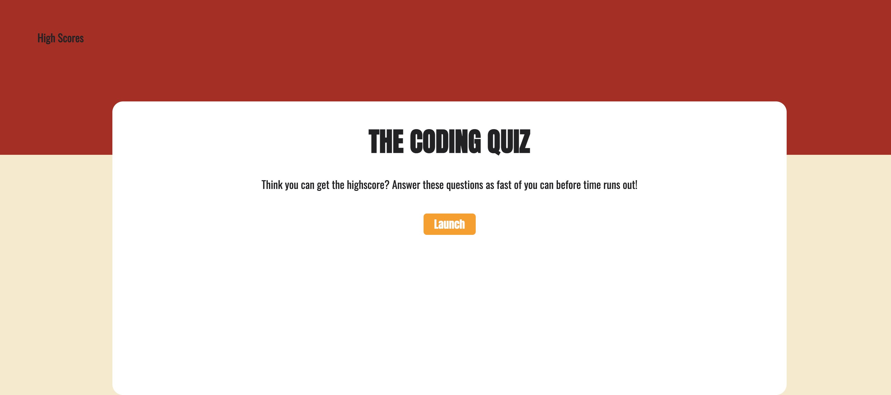

# 04-Coding-Quiz

## Description

This project we were tasked with creating a timed quiz. It will randomly select a question from the array and if the user selects the correct answer there will be a confirmation and if incorrect they will be told it was incorrect.

This challenge we had to create everything from the ground up, I started by creating the HTML file and used the previous challenge as a guide for my HTML. Then I started getting some styling for the page and then spent most of the time getting the JavaScript set up. 
I created an array full of all the questions and answers to those questions.

Then variables for every element, then started creating all the functions. I also added sound for when the user gets the correct answer right/wrong.

This challenge was definitely stretching to get more used to javascript and how to use it.

## Links

Attached are links for this challenge.

GitHub:
https://github.com/Christianmsm/04-Coding-Quiz

Deployed Site:
https://christianmsm.github.io/04-Coding-Quiz/

Screenshot:

## Credits

Completing this challenge I used youtube, w3schools, and freeCodeCamp.com

I also re-watched the classes covering JavaScript.

## License

MIT License

Copyright (c) 2023 Christianmsm

Permission is hereby granted, free of charge, to any person obtaining a copy
of this software and associated documentation files (the "Software"), to deal
in the Software without restriction, including without limitation the rights
to use, copy, modify, merge, publish, distribute, sublicense, and/or sell
copies of the Software, and to permit persons to whom the Software is
furnished to do so, subject to the following conditions:

The above copyright notice and this permission notice shall be included in all
copies or substantial portions of the Software.

THE SOFTWARE IS PROVIDED "AS IS", WITHOUT WARRANTY OF ANY KIND, EXPRESS OR
IMPLIED, INCLUDING BUT NOT LIMITED TO THE WARRANTIES OF MERCHANTABILITY,
FITNESS FOR A PARTICULAR PURPOSE AND NONINFRINGEMENT. IN NO EVENT SHALL THE
AUTHORS OR COPYRIGHT HOLDERS BE LIABLE FOR ANY CLAIM, DAMAGES OR OTHER
LIABILITY, WHETHER IN AN ACTION OF CONTRACT, TORT OR OTHERWISE, ARISING FROM,
OUT OF OR IN CONNECTION WITH THE SOFTWARE OR THE USE OR OTHER DEALINGS IN THE
SOFTWARE.
